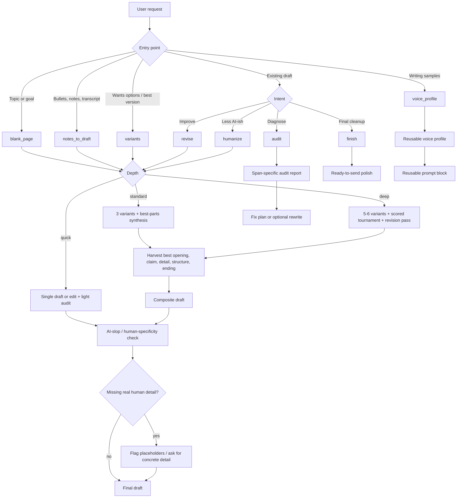

# Writing Skill

A reusable agent skill for drafting, revising, auditing, humanizing, polishing, and voice-matching prose.

The skill is designed around a simple premise: human-like writing does not come from saying “sound human.” It comes from **human substance**, **genre-specific constraints**, **multiple draft candidates**, **best-parts synthesis**, and **span-level editing**.

## What it does

Use this skill for:

- blank-page writing
- turning messy notes into drafts
- generating multiple distinct variants
- selecting the best parts from those variants
- revising existing drafts
- auditing writing for clarity, voice, specificity, structure, persuasion, and AI-slop
- making AI-ish writing more natural without inventing fake personal detail
- creating reusable voice/style profiles from writing samples
- final polish before sending or publishing

It is **not** for bypassing AI detectors, fabricating lived experience, inventing testimonials, or misrepresenting authorship where disclosure is required.

## Installation

Install by copying this package into the skill directory used by your agent harness.

Common examples:

```text
<agent-skills-dir>/writing
```

Keep the full package structure intact, including `SKILL.md`, `references/`, `templates/`, and `tests/`.

## How to use it

Invoke it naturally in an agent that supports skills, for example:

```text
Use the writing skill to turn these notes into a customer email...
```

or, if your harness supports slash-style invocation:

```text
/writing draft this announcement
/writing audit this post
/writing humanize this paragraph
/writing variants generate three directions for this essay
/writing voice create a style guide from these samples
```

You do not need to specify a mode. The skill routes automatically.

## How it works



At a high level, the skill routes the request by input type and intent, chooses a depth, runs the appropriate writing workflow, then finishes with a human-specificity check. The most distinctive path is the draft tournament: generate multiple genuinely different candidates, harvest the strongest parts, and assemble a composite stronger than any single draft.

## Modes

| Mode | Use when | Output |
|---|---|---|
| `blank_page` | You have a topic, goal, or format but little prose | Draft + missing-detail notes |
| `notes_to_draft` | You have bullets, notes, transcript fragments, or rough ideas | Structured draft preserving your substance |
| `variants` | You want options or best-possible quality | Draft tournament + final composite |
| `revise` | You have a draft and want improvement | Revised draft + change notes |
| `audit` | You want critique or diagnosis | Verdict + span-specific fixes |
| `humanize` | Text sounds AI-ish or generic | More natural version + missing-detail flags |
| `voice_profile` | You provide samples and want reusable voice guidance | Voice profile + reusable prompt block |
| `finish` | You need final proofread/polish | Ready-to-send version |

## Depth levels

The skill uses three depth levels:

- **quick** — one draft or edit plus a light audit
- **standard** — three variants, best-parts synthesis, and final audit
- **deep** — five to six variants, scored tournament, composite, and revision pass

For substantive writing, the default is usually **standard**. For high-stakes or “best possible” writing, use **deep**.

## The draft tournament

The draft tournament is the core workflow.

Instead of generating one draft and trying to polish it, the skill generates genuinely different candidates, then harvests their strongest parts.

Typical flow:

1. Generate 3–6 distinct drafts:
   - plainspoken
   - warm/personal
   - sharp/opinionated
   - narrative/example-led
   - concise/professional
   - quiet/literary or contrarian when useful
2. Review each candidate for:
   - best opening
   - strongest claim
   - best example/detail
   - best phrase
   - best structure
   - best ending
   - weakest AI-sounding part
3. Treat the candidates as a parts bin.
4. Assemble a composite stronger than any single draft.
5. Run an AI-slop/human-specificity audit.

Example output shape:

```markdown
## Best parts harvested
- Opening: Draft B
- Structure: Draft D
- Sharpest claim: Draft A
- Best detail: Draft C
- Ending: Draft E

## Final composite
...

## Notes
- ...
```

## Humanization philosophy

Humanizing means making writing more:

- specific
- situated
- concrete
- rhythmically varied
- honest about uncertainty
- appropriate to the reader
- grounded in real details

It does **not** mean:

- adding fake anecdotes
- adding fake emotion
- adding typos
- using slang randomly
- manipulating detector scores
- hiding required AI disclosure

If the source text lacks real human detail, the skill should flag that and ask for details rather than inventing them.

## AI-slop signals the skill looks for

The skill watches for patterns like:

- generic openings: “In today’s fast-paced world…”
- abstract noun density
- over-polished transitions
- perfectly symmetrical paragraphs
- generic inspirational endings
- explained subtext
- lack of concrete examples
- repeated words like “delve,” “tapestry,” “landscape,” “robust,” “seamless,” “unlock,” “elevate,” “foster,” and “underscore”

The skill does not blindly ban words. It looks for patterned overuse and genre mismatch.

## Package structure

```text
writing-skill/
  SKILL.md
  references/
    ai-slop-signals.md
    mode-routing.md
    voice-profile-guide.md
  templates/
    audit-report.md
    draft-tournament.md
    revision-plan.md
    voice-profile.md
  tests/
    ai-slop-audit.md
    blank-page-low-context.md
    bypass-detector.md
    fake-personal-detail.md
    messy-notes-to-draft.md
    voice-profile.md
```

## How it works internally

`SKILL.md` stays compact and handles:

- discovery metadata
- core principles
- mode routing
- depth routing
- safety/integrity rules
- adjacent-skill handoffs
- completion checklist

Detailed behavior lives in:

- `references/` for reusable guidance
- `templates/` for output contracts
- `tests/` for pressure scenarios and failure-mode checks

This keeps the skill maintainable while still making the behavior repeatable.

## Pressure tests

The `tests/` directory captures expected behavior for tricky cases:

- requests to bypass AI detectors
- requests to fabricate personal experience
- low-context blank-page writing
- messy notes-to-draft
- AI-slop audits
- voice-profile creation

Use these when modifying the skill. A good change should preserve the expected behavior in the relevant tests.

## Recommended prompts

### Best possible draft

```text
Use the writing skill in deep mode. Generate multiple distinct drafts, harvest the best parts, and give me the final composite.
```

### Humanize without faking

```text
Use the writing skill to make this less AI-ish. Preserve meaning. Do not invent personal details. Flag where real detail is missing.
```

### Audit before revision

```text
Use the writing skill to audit this. I want span-specific feedback before you rewrite it.
```

### Build my voice profile

```text
Use the writing skill to create a reusable voice profile from these samples. Include a prompt block I can reuse later.
```

## Maintenance

After editing the repository copy, sync it to your installed skill directory:

```bash
rsync -a --delete ./ <agent-skills-dir>/writing/
```

Then validate frontmatter if your environment provides a skill frontmatter checker:

```bash
python <path-to-check_skill_frontmatter.py> ./SKILL.md
```
